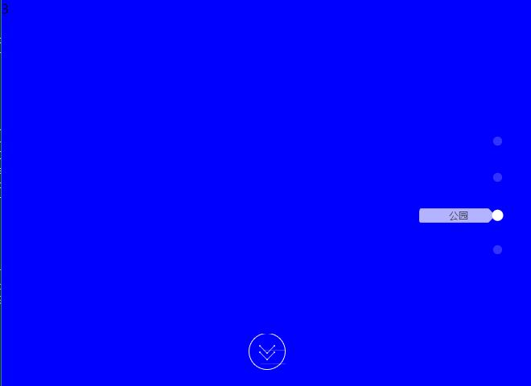

# jQscroll
### JQ整页面滚屏插件 ###

<p align="center">
  <a href="https://cwsjoker.github.io/mystatic/jQscroll/index.html" target="_blank">
    
    <br>
    Live Demo
  </a>
</p>

## Build Setup

``` bash
# HTML
<div class="block pageScroll-container">
	<div class="pageScroll-scrollbox">
		<div class="pageScroll-section" style="background:#f00;">1</div>
		<div class="pageScroll-section" style="background:#0f0;">2</div>
		<div class="pageScroll-section" style="background:#00f;">3</div>
		<div class="pageScroll-section" style="background:#ff0;">4</div>
	</div>
</div>
# JavaScript
$('.block').pageScroll({
	direction : 'vertical',
	list : ['学校','幼儿园','公园','沙滩'],
	callback : function() {
		console.log('动画完成执行');
	},
	callbackIndex : 3
});
#Param
index : 0,	//默认开始的页码
easing : 'ease',	//滚动的贝塞尔曲线
duration : 500,		//滚动时间间隔
direction : 'vertical',		//横纵向滚动设置，默认纵向。
keyboard : true,	//是否支持键盘事件
list : [],	//滚动每个页面的值
callback : null,	//指定滚屏结束的回调函数
callbackIndex : 'all'	//指定回调函数在特定页面执行
```
